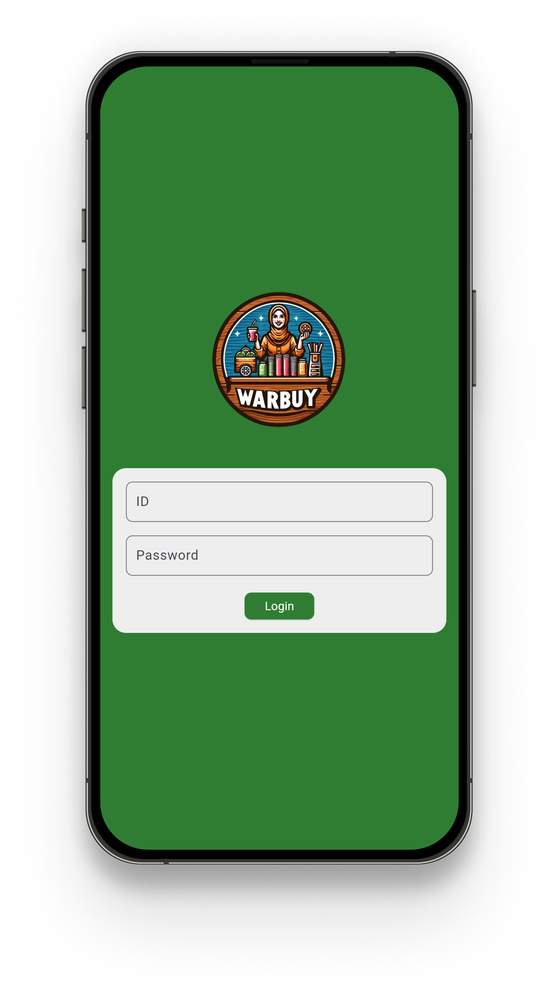
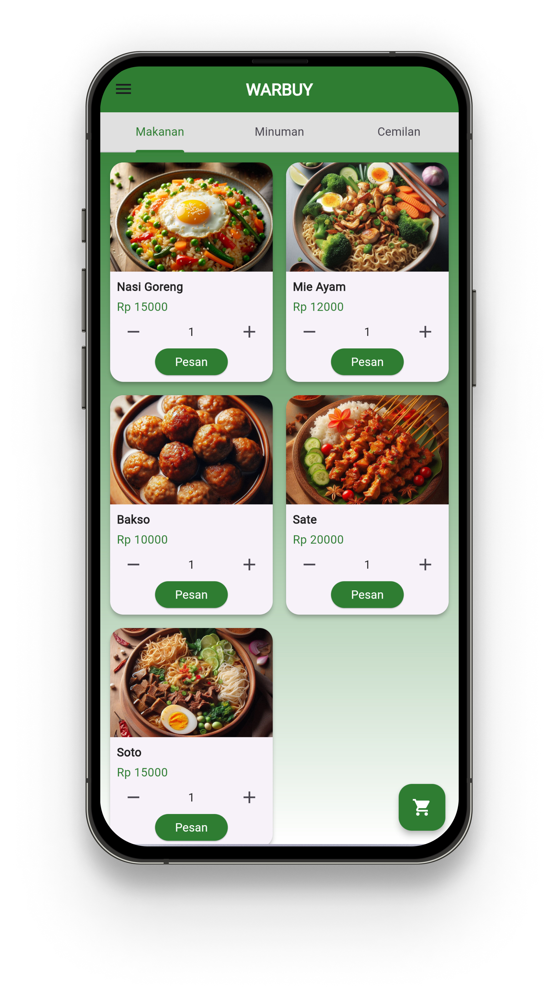
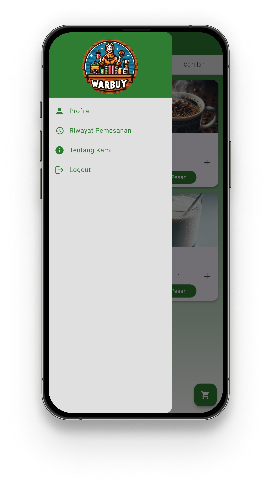

# Warbuy

Warbuy is a vibrant and user-friendly e-commerce application developed with Flutter, designed to offer a seamless shopping experience for a variety of food items including meals, drinks, and snacks.

## Features

- **User Authentication:** Simple login functionality with validation.
- **Product Categories:** Browse through different categories such as Makanan, Minuman, and Cemilan.
- **Cart Management:** Add items to your cart, view your cart, and confirm orders.
- **Order History:** Track past orders.
- **User Profile:** View user profile information.
- **About Us:** Information about the Warbuy application.

## Screenshots

   

## Getting Started

### Prerequisites

- Flutter SDK
- A code editor (like VS Code or Android Studio)

### Installation

1. **Clone the repository:**
   ```bash
   git clone https://github.com/your-username/warbuy.git
